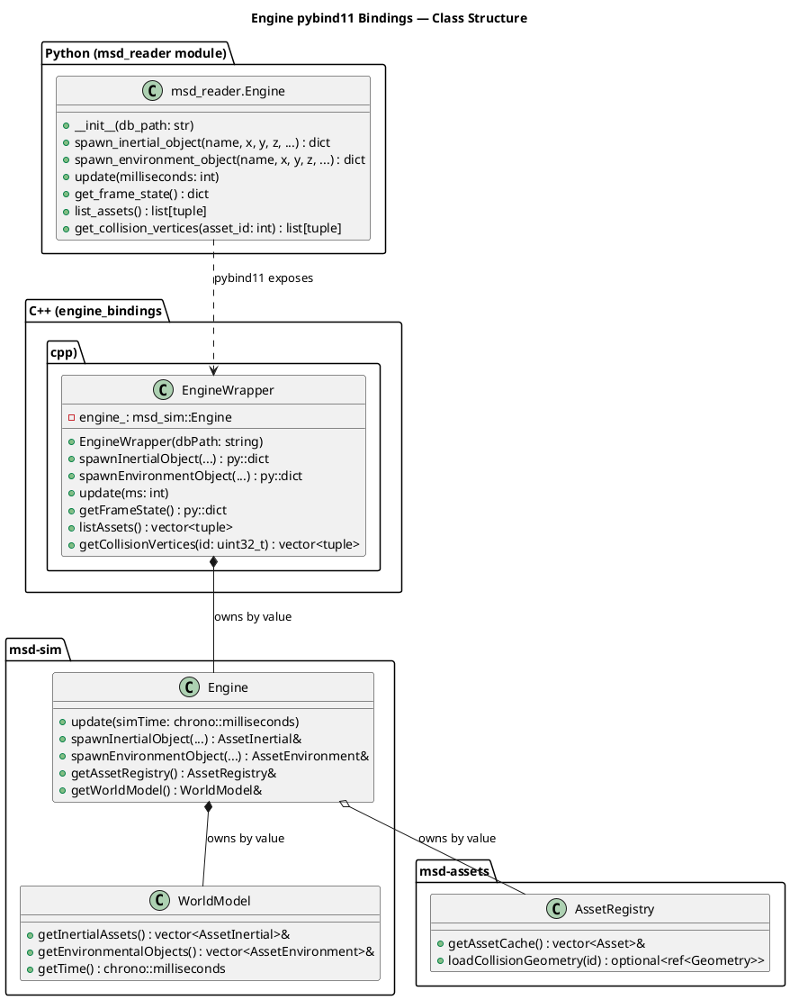

# Retroactive Design Review: 0072a Engine pybind11 Bindings

**Date**: 2026-02-20
**Reviewer**: Workflow Orchestrator (retroactive)
**Status**: Complete
**Purpose**: Reconstruct what the Design, Integration Design, and Python Design phases should have produced; identify gaps, errors, and deviations from project standards; create follow-up items where issues exist.

---

## Background

Ticket 0072a went directly from Draft to Implementation, bypassing the Design, Integration Design, and Python Design phases that are now required by the current workflow template. This document retroactively reconstructs what those phases should have produced, evaluates the actual implementation against those expected outputs, and identifies any issues that remain actionable.

---

## Part 1: What the Design Phase Should Have Produced

### Expected Artifact: `docs/designs/0072a_engine_pybind_bindings/design.md`

A design phase would have been expected to answer the following questions before implementation began.

#### 1.1 Component Architecture

The design should have described the wrapper class structure:

```
msd_reader (Python module)
    └── Engine  [exposed as msd_reader.Engine]
            ↑ wraps
        EngineWrapper  [C++ class in engine_bindings.cpp]
                ↑ owns by value
            msd_sim::Engine
                    ├── msd_assets::AssetRegistry
                    └── msd_sim::WorldModel
                                └── std::vector<AssetInertial>
                                └── std::vector<AssetEnvironment>
```

**Verdict**: The implementation correctly reflects this structure. No deviations.

#### 1.2 Design Decisions That Should Have Been Recorded

The following decisions were made implicitly during implementation. The design phase should have made each explicit.

---

### DD-0072a-001: Wrapper Class Owns Engine by Value

**Affects**: `EngineWrapper` (constructor, member `engine_`)

**Rationale**: The Python binding owns the full simulation lifecycle. `Engine` has no shared ownership semantics, and the binding is the exclusive consumer. Owning by value avoids an unnecessary heap allocation and makes the ownership contract explicit.

**Alternatives Considered**:
- `std::unique_ptr<msd_sim::Engine>`: Adds heap indirection with no benefit since the wrapper is the sole owner.
- `std::shared_ptr<msd_sim::Engine>`: Violates project guideline to avoid `shared_ptr` without a clear shared-ownership requirement.

**Trade-offs**: Copying an `EngineWrapper` is impossible (Engine is not copyable). This is the correct behavior.

**Status**: active

---

### DD-0072a-002: No Eigen Type Casters — All Conversion in C++ Wrapper

**Affects**: `EngineWrapper::spawnInertialObject`, `EngineWrapper::spawnEnvironmentObject`, `EngineWrapper::getFrameState`

**Rationale**: pybind11-Eigen type casters require the `pybind11/eigen.h` header and expose Eigen's memory layout to Python consumers. The Python API should present only plain types (dicts, tuples, scalars). Converting inside the wrapper keeps the Python API stable regardless of changes to internal Eigen types.

**Alternatives Considered**:
- pybind11 Eigen casters: Would expose `Coordinate`, `AngularCoordinate`, and `Eigen::Quaterniond` as NumPy arrays or custom objects, adding a NumPy dependency and complicating the web API serialization path.

**Trade-offs**: Increases wrapper verbosity (explicit `.x()`, `.y()`, `.z()`, `.w()` calls). Accepted cost.

**Status**: active

---

### DD-0072a-003: `update()` Receives Absolute Simulation Time, Not Delta

**Affects**: `EngineWrapper::update`, downstream callers in `msd/msd-sim/src/Engine.hpp`

**Rationale**: The underlying `WorldModel::update(std::chrono::milliseconds simTime)` receives absolute simulation time, not a delta. This was discovered during implementation (not anticipated in the ticket requirements) when examining `WorldModel.hpp`. The Python wrapper faithfully passes through this semantics.

**Alternatives Considered**:
- Wrapping to accept deltas: The wrapper could maintain cumulative time internally and convert delta to absolute. This would hide the C++ API's semantics, making the wrapper's behavior diverge from the C++ API.

**Trade-offs**: Callers must track cumulative time themselves. This is documented in docstrings, tests (`test_update_multiple_steps`), and CLAUDE.md, but was not flagged in the ticket requirements — a gap in the original requirements.

**Status**: active — **follow-up item** (see Part 4, FU-001)

---

### DD-0072a-004: `get_frame_state()` Excludes Environment Objects

**Affects**: `EngineWrapper::getFrameState`

**Rationale**: The frame state iterates only `worldModel.getInertialAssets()` (dynamic bodies). Static environment objects (`getEnvironmentalObjects()`) are excluded.

**Alternatives Considered**:
- Including environment objects with zero velocity: The ticket requirement R2 explicitly mentions this ("Include environmental objects with zero velocity/angular_velocity"). This was NOT implemented as specified.

**Trade-offs**: Environment objects are static by definition, so their positions are known from spawn time. The 0072b WebSocket endpoint can serve their geometry separately. However, this is a deviation from the stated requirement.

**Status**: active — **follow-up item** (see Part 4, FU-002)

---

### DD-0072a-005: `EngineWrapper` Exposes `getCollisionVertices` Independently from `AssetRegistry`

**Affects**: `EngineWrapper::getCollisionVertices`, `AssetRegistryWrapper::getCollisionVertices`

**Rationale**: `EngineWrapper` provides its own `get_collision_vertices()` by accessing `engine_.getAssetRegistry()` internally. This duplicates functionality already in `AssetRegistryWrapper`. The duplication was accepted because `AssetRegistryWrapper` requires a separate Python object (`msd_reader.AssetRegistry`) while the Engine binding should be a self-contained API.

**Alternatives Considered**:
- Not exposing `get_collision_vertices` on Engine: Would require the Python caller to instantiate both an Engine and a separate AssetRegistry — two database connections for geometry lookup.

**Trade-offs**: Minor code duplication between `AssetRegistryWrapper::getCollisionVertices` and `EngineWrapper::getCollisionVertices`. Implementation is identical. This should be refactored into a shared free function if a third caller appears.

**Status**: active

---

### Expected Artifact: `docs/designs/0072a_engine_pybind_bindings/0072a_engine_pybind_bindings.puml`

A design phase would have been expected to produce a PlantUML diagram. The documentation phase correctly noted that "No PlantUML design diagram was warranted" given that this is an implementation-only ticket following an established pattern. However, for completeness, below is the diagram that should have been produced:



**Assessment**: The documentation phase correctly decided this diagram was not warranted for a pattern-following ticket. The existing `msd-pybind/CLAUDE.md` prose documentation serves the same purpose.

---

## Part 2: What the Integration Design Phase Should Have Produced

This ticket is a multi-language feature (C++ wrapper + Python consumer). The current workflow requires an Integration Design phase for such tickets, producing:
- `docs/designs/0072a_engine_pybind_bindings/integration-design.md`
- `docs/designs/0072a_engine_pybind_bindings/0072a-sequence.puml`
- Updates to `docs/api-contracts/contracts.yaml`

### 2.1 What the Integration Design Should Have Covered

#### C++ to Python Type Mapping Contract

The integration design should have formally documented the type mapping between the C++ Engine API and the Python boundary:

| C++ Type | Python Representation | Notes |
|---|---|---|
| `const std::string&` | `str` | Bidirectional for paths and asset names |
| `double` / `int` | `float` / `int` | Scalars passed directly |
| `msd_sim::Coordinate` | `{"x": float, "y": float, "z": float}` | dict, keys always present |
| `Eigen::Quaterniond` | `{"w": float, "x": float, "y": float, "z": float}` | dict, WXYZ ordering |
| `msd_sim::AngularCoordinate` | Decomposed to 3 `double` args | At boundary only |
| `std::chrono::milliseconds` | `int` | Python caller passes ms as int |
| `AssetInertial&` (return) | `{"instance_id": int, "asset_id": int}` | dict |
| `AssetEnvironment&` (return) | `{"instance_id": int, "asset_id": int}` | dict |
| `std::vector<std::tuple<uint32_t, std::string>>` | `list[tuple[int, str]]` | `list_assets()` |
| `std::vector<std::tuple<double, double, double>>` | `list[tuple[float, float, float]]` | `get_collision_vertices()` |
| C++ exceptions (`std::runtime_error`) | Python `RuntimeError` | pybind11 automatic translation |

**Assessment**: This contract is implicit in the code and documented in CLAUDE.md, but was never formally specified. The 0072b WebSocket endpoint will need to serialize the `get_frame_state()` dict to JSON — any change to the dict schema at this boundary breaks 0072b without notice.

#### Sequence Diagram

The integration design should have produced a sequence diagram showing the call flow from the FastAPI server to the C++ simulation and back. This is absent.

#### API Contracts

The integration design should have registered the `get_frame_state()` return schema in `docs/api-contracts/contracts.yaml` (if that file exists). This was not done.

**Assessment**: The omission of a formal API contract between the Python binding and the downstream 0072b WebSocket endpoint is a gap. The schema is currently defined only implicitly in the implementation and in CLAUDE.md prose. If the frame state schema changes, there is no formal contract to alert the 0072b implementer. This is a medium-severity gap for the live simulation feature.

**Follow-up item**: see Part 4, FU-003.

---

## Part 3: What the Python Design Phase Should Have Produced

### Expected Artifact: `docs/designs/0072a_engine_pybind_bindings/python/design.md`

The Python design phase would have been expected to document:
1. The Python API surface (method signatures, defaults, return types)
2. Python-specific error handling strategy
3. Python-side usage patterns for the FastAPI context
4. Thread safety constraints visible to Python callers

### 3.1 Assessment of Python API Design Quality

The implemented Python API is evaluated below against what a Python design phase would have specified.

#### API Surface — Verdict: GOOD

The Python API is clean and idiomatic. All method names use `snake_case`, default arguments are appropriate (`pitch=0.0`, `mass=10.0`), and return types are plain Python structures (dicts, lists, tuples). No Eigen objects cross the boundary.

One concern: The `spawn_inertial_object` signature presents `x`, `y`, `z` as positional-only in practice, while `pitch`, `roll`, `yaw`, `mass`, `restitution`, `friction` are keyword-optional. A Python design phase would have explicitly specified which parameters should be keyword-only (`*` separator) to prevent callers from passing `mass` positionally by mistake.

**Follow-up item**: see Part 4, FU-004.

#### Python Error Handling — Verdict: ACCEPTABLE with Gap

pybind11 automatically translates C++ exceptions to Python exceptions. `std::runtime_error` becomes `RuntimeError`. This is the correct behavior and matches what a Python design phase would have specified.

One gap: `spawn_inertial_object` on the Python side raises an opaque `RuntimeError` with a C++ error message. A Python design phase would have noted whether to add a Python-level validator to produce more ergonomic errors (e.g., `ValueError: mass must be positive` rather than the C++ `std::invalid_argument` text). The current behavior is acceptable but not ideal for FastAPI integration.

#### Thread Safety Documentation — Verdict: COMPLETE

Thread safety is documented in CLAUDE.md and in the `bind_engine()` registration. A Python design phase would have confirmed that the FastAPI handler must hold an asyncio lock or route all Engine calls through a single-threaded executor. This is flagged in CLAUDE.md but is a runtime concern with no enforcement mechanism.

**Follow-up item**: see Part 4, FU-005.

---

## Part 4: Identified Gaps and Follow-Up Items

### FU-001: `update()` Absolute-Time Semantics Not in Original Requirements

**Severity**: Low
**Description**: Requirement R2 and the ticket's Python API spec show `engine.update(16)` without specifying whether `16` is a delta or absolute time. The implementation correctly uses absolute time (matching the C++ `WorldModel::update(simTime)` semantics), but this was discovered during implementation, not specified upfront.

**Impact**: The 0072b WebSocket server must be implemented with awareness of this semantics. If 0072b assumes delta-time, the simulation will not advance correctly.

**Recommendation**: Add a note to the 0072b ticket in its Design Decisions section: "Engine.update(ms) receives absolute simulation time. The WebSocket loop must maintain a cumulative time counter and pass increasing values (e.g., 16, 32, 48...) rather than a fixed delta."

**Action**: Document in 0072b ticket before design phase begins.

---

### FU-002: Requirement R2 — Environment Objects Not Included in `get_frame_state()`

**Severity**: Medium
**Description**: Requirement R2 explicitly states: "Include environmental objects with zero velocity/angular_velocity." The implementation does NOT include environment objects in `get_frame_state()`. Only inertial assets are returned.

Examining the `WorldModel` API: `getEnvironmentalObjects()` returns `const std::vector<AssetEnvironment>&`. The `AssetEnvironment` type (from `AssetEnvironment.hpp`) provides `getInstanceId()`, `getAssetId()`, and `getReferenceFrame()`. Including environment objects in the frame state would require iterating this vector and appending their positions with zeroed velocity fields.

**Current behavior**:
```python
frame = engine.get_frame_state()
# frame["states"] contains only inertial (dynamic) objects
# environment (static) objects are absent
```

**Expected behavior per R2**:
```python
frame = engine.get_frame_state()
# frame["states"] should also contain environment objects with velocity={x:0,y:0,z:0}
# and angular_velocity={x:0,y:0,z:0}
```

**Assessment of impact**: For the 0072b WebSocket use case, the frontend needs environment geometry for rendering floors, walls, and boundaries. Currently the frontend must use a separate `get_collision_vertices()` call per asset and remember the spawn positions itself. Including environment objects in frame state would simplify the frontend. However, environment objects never move, so their positions are known from spawn time — this is information redundancy at 60 fps.

**Recommendation**: Either:
(a) Fix `get_frame_state()` to include environment objects (matches R2 literally), or
(b) Formally close R2 as "won't fix" with rationale: environment object positions are known at spawn time and do not change, making per-frame inclusion wasteful.

**Action**: Decision required from ticket author before 0072b design phase.

---

### FU-003: No Formal API Contract for `get_frame_state()` Schema

**Severity**: Medium
**Description**: The `get_frame_state()` return schema is the primary data contract between 0072a (this binding) and 0072b (the WebSocket endpoint that will serialize it as JSON). The schema is documented only in CLAUDE.md prose and implicit in the Python tests.

**Risk**: If the frame state schema changes (e.g., field renamed from `body_id` to `object_id`, or `simulation_time` moved to a different key), the 0072b implementer has no formal contract to diff against.

**Recommendation**: Add a JSON Schema or structured YAML definition of the frame state payload to `docs/api-contracts/` before 0072b implementation begins. This is the exact use case the api-contracts file was designed for.

**Action**: Create `docs/api-contracts/engine-frame-state.yaml` or equivalent as part of 0072b's Integration Design phase.

---

### FU-004: `spawn_inertial_object` Allows Accidental Positional Use of Physics Parameters

**Severity**: Low
**Description**: The Python binding exposes:
```python
engine.spawn_inertial_object(
    asset_name, x, y, z,
    pitch=0.0, roll=0.0, yaw=0.0,
    mass=10.0, restitution=0.5, friction=0.5)
```

Because `pitch`, `roll`, `yaw`, `mass`, `restitution`, and `friction` are keyword arguments with defaults, a caller could pass them positionally:
```python
engine.spawn_inertial_object("cube", 0, 0, 5, 0, 0, 0, 20.0)
# This works but is confusing: is 20.0 mass? or yaw?
```

pybind11 does not support Python 3's keyword-only separator (`*`). The current design is consistent with other wrappers in this codebase (`AssetRegistryWrapper`, `DatabaseWrapper`) and is acceptable given the pybind11 constraint.

**Recommendation**: Document in CLAUDE.md that callers should use keyword arguments for all optional parameters. This is already the case in the test suite.

**Action**: No code change required. Note acknowledged.

---

### FU-005: Thread Safety — No Runtime Enforcement for FastAPI

**Severity**: Low
**Description**: `EngineWrapper` (and the underlying `msd_sim::Engine`) is not thread-safe. FastAPI uses an async event loop, and if route handlers call `engine.update()` or `engine.get_frame_state()` concurrently, the simulation state may be corrupted.

There is no runtime enforcement (no mutex in `EngineWrapper`, no GIL dependency documented). The documentation notes "not thread-safe" but provides no guidance for the FastAPI integration pattern.

**Recommendation**: The 0072b WebSocket endpoint design should address this explicitly. Options include:
1. A single background asyncio task runs the simulation loop; route handlers only read `get_frame_state()` (acceptable if simulation loop and get_frame_state are not concurrent).
2. A threading.Lock around all Engine calls.
3. Running the simulation in a thread pool executor and serializing all access.

**Action**: Add thread safety guidance to 0072b's Python Design phase.

---

## Part 5: Conformance to Project Coding Standards

A systematic review of `engine_bindings.cpp` against the standards in `CLAUDE.md`:

| Standard | Status | Notes |
|---|---|---|
| Brace initialization `{}` | PASS | `Coordinate{x, y, z}`, `AngularCoordinate{pitch, roll, yaw}` used throughout |
| NaN for uninitialized floats | N/A | No uninitialized float members in wrapper |
| Rule of Zero | PASS | No special member functions defined; `msd_sim::Engine` handles its own lifetime |
| `unique_ptr` for ownership | PASS | Engine owned by value (correct — no heap allocation needed) |
| No `shared_ptr` | PASS | No shared ownership used |
| No raw pointers | PASS | No raw pointer members or returns |
| `const T&` for non-owning access | PASS | `const auto& worldModel`, `const auto& asset`, `const auto& state`, `const auto& frame` |
| `std::optional<std::reference_wrapper>` for optional non-owning | PASS | `geoOpt->get()` used correctly after `has_value()` check |
| `PascalCase` for classes | PASS | `EngineWrapper` |
| `camelCase` for methods | PASS | `spawnInertialObject`, `getFrameState`, `listAssets`, `getCollisionVertices` |
| `snake_case_` for members | PASS | `engine_` |
| Doxygen on public API | PASS | All methods have Doxygen comments |
| Ticket reference at top | PASS | `// Ticket: 0072a_engine_pybind_bindings` |
| Return values not output parameters | PASS | All methods return by value |
| One class per header | N/A | `EngineWrapper` is in a `.cpp` file (binding implementation) — correct for pybind |

**Two redundant includes** were noted by the implementation reviewer (m1, m2 in `implementation-review.md`). These are stylistically acceptable and do not warrant a code change.

**Overall standards conformance: PASS**

---

## Part 6: Summary Assessment

### What Was Done Well

1. **Pattern adherence**: `EngineWrapper` faithfully follows the `DatabaseWrapper` / `AssetRegistryWrapper` pattern. The structure, naming, and binding style are consistent with the rest of the codebase.

2. **Eigen isolation**: The design decision to convert all Eigen types inside the C++ wrapper (DD-0072a-002) is the correct approach for this use case.

3. **Documentation discovery**: The `update()` absolute-time semantics (DD-0072a-003) was correctly identified during implementation and prominently documented in both CLAUDE.md and test docstrings.

4. **Test coverage**: 36 tests cover all acceptance criteria, including physics validation (`test_body_falls_under_gravity`) and error paths (unknown asset, invalid path, unknown ID).

5. **CLAUDE.md updates**: All three relevant CLAUDE.md files were updated with accurate information.

### What Was Missing

1. **Formal design artifacts**: No `design.md`, no `integration-design.md`, no `python/design.md`. The ticket requirements were used directly as the design specification. For a pattern-following implementation, this was workable; for a more novel integration, it would have introduced risk.

2. **Requirement R2 deviation**: Environment objects are not included in `get_frame_state()` despite the requirement stating they should be. This is the most significant functional gap.

3. **API contract formalization**: No formal schema contract for the `get_frame_state()` return value, which is the primary integration point for 0072b.

4. **PlantUML diagram**: Absent. Acceptable given the implementation-only nature of the ticket, but the absence means the pybind module's architecture is not diagrammatically captured anywhere in `docs/`.

### Actionable Follow-Up Items

| ID | Severity | Description | Assignee |
|---|---|---|---|
| FU-001 | Low | Document absolute-time semantics in 0072b ticket before design | 0072b author |
| FU-002 | Medium | Decide: include environment objects in `get_frame_state()` or formally close R2 as won't fix | Ticket author |
| FU-003 | Medium | Formalize `get_frame_state()` JSON schema as api-contract before 0072b implementation | 0072b Integration Design |
| FU-004 | Low | Document keyword-arg usage recommendation in tests/CLAUDE.md (no code change) | Already in CLAUDE.md — acknowledged |
| FU-005 | Low | Address thread safety pattern explicitly in 0072b Python Design | 0072b Python Design |

---

## Appendix: Files Reviewed

| File | Role |
|---|---|
| `tickets/0072a_engine_pybind_bindings.md` | Source ticket |
| `msd/msd-pybind/src/engine_bindings.cpp` | Implementation under review |
| `msd/msd-pybind/test/test_engine_bindings.py` | Test suite (36 tests) |
| `msd/msd-pybind/src/msd_bindings.cpp` | Module entry point |
| `msd/msd-pybind/CMakeLists.txt` | Build configuration |
| `msd/msd-pybind/src/database_bindings.cpp` | Pattern reference (DatabaseWrapper) |
| `msd/msd-pybind/src/asset_registry_bindings.cpp` | Pattern reference (AssetRegistryWrapper) |
| `msd/msd-sim/src/Engine.hpp` | C++ Engine public API |
| `msd/msd-sim/src/Environment/WorldModel.hpp` | WorldModel API |
| `msd/msd-pybind/CLAUDE.md` | Post-implementation documentation |
| `msd/msd-sim/CLAUDE.md` | Library documentation |
| `msd/CLAUDE.md` | Architecture documentation |
| `docs/designs/0072a_engine_pybind_bindings/implementation-review.md` | Phase artifact |
| `docs/designs/0072a_engine_pybind_bindings/quality-gate-report.md` | Phase artifact |
| `docs/designs/0072a_engine_pybind_bindings/doc-sync-summary.md` | Phase artifact |
| `.claude/templates/ticket.md.template` | Current workflow template |
